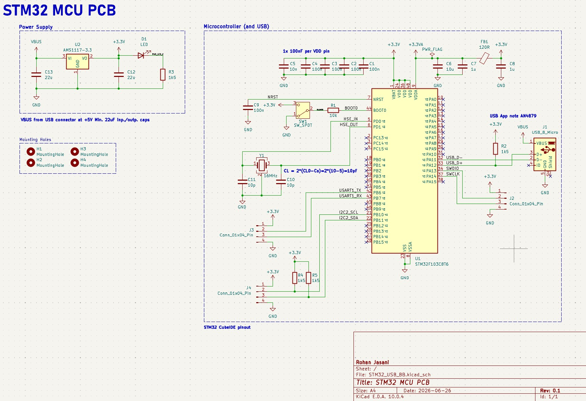

# Technical Design Document: STM32F103 Custom Microcontroller Board

## 1. Summary

The objective of this design was to engineer a custom, self-contained microcontroller breakout board utilizing the **STM32F103C8T6** ARM Cortex-M3 MCU. The board is optimized for rapid hardware prototyping, featuring standard serial and debugging interfaces (`USART1`, `I2C2`, and `SWD`) broken out to 4-pin headers for easy peripheral integration. 

To ensure seamless firmware deployment, debugging, and data transfer without relying on specialized external hardware, the board features an integrated **Micro-USB interface** mapped directly to the MCU's native USB peripheral. The power architecture steps down the 5V USB input to a regulated 3.3V, providing clean power to both the digital and analog domains of the STM32.

## 2. Design Requirements & Specifications

The hardware parameters and configured interfaces for the custom MCU board are detailed in the table below:

| Parameter / Interface           | Design Target / Configuration |
| :------------------------------ | :---------------------------- |
| **Microcontroller (MCU)**       | STM32F103C8T6                 |
| **System Clock (HSE)**          | 16 MHz External Crystal (Y1)  |
| **Primary Power Input**         | Micro-USB Interface (5V)      |
| **LDO Regulator**               | AMS1117-3.3                   |
| **Communication Protocols**     | USART1, I2C2, USB Full-Speed  |
| **Programming/Debug Interface** | Serial Wire Debug (SWD)       |
| **Boot Configuration**          | SPDT Hardware BOOT0 Switch    |

## 3. System Architecture & Peripheral Configuration

### 3.1. Power Architecture & Analog Filtering
The board utilizes a Micro-USB port acting as the primary 5V power input. This rail (`VBUS`) is regulated down to a clean **3.3V** via an `AMS1117-3.3` Low-Dropout (LDO) regulator, buffered by 22uF input and output capacitors (C12, C13). 
* **Digital Power:** Decoupling capacitors (100nF and 10nF) are placed closely to every $V_{DD}$ pin on the MCU to suppress high-frequency switching noise.
* **Analog Power (**$V_{DDA}$**):** To ensure high accuracy for the internal ADCs, the analog supply is isolated from the main digital 3.3V rail using an LC filter composed of a $120\Omega$ ferrite bead (FB1) and a dedicated capacitance network (10uF, 1uF).

### 3.2. Clocking & USB Interface
* **HSE Oscillator:** A 16MHz external crystal (Y1) drives the High-Speed External (HSE) clock, utilizing 10pF load capacitors (C10, C11) for stable oscillation.
* **Native USB Full-Speed:** Unlike boards that rely on external UART-to-USB bridge ICs, this design routes the USB $D+$ (PA12) and $D-$ (PA11) lines directly to the STM32's native USB peripheral. A crucial **1.5kΩ pull-up resistor (R2)** is tied to the $D+$ line to strictly enforce USB Full-Speed device enumeration upon connection to a host.

### 3.3. Serial Communication & Debugging Interfaces
The layout prioritizes high-accessibility signal routing to break out critical communication interfaces to external 4-pin headers:
* **USART1:** The TX (PA9) and RX (PA10) lines are broken out for serial debugging and data logging.
* **I2C2:** The SCL (PB10) and SDA (PB11) lines are routed with onboard 1.5kΩ pull-up resistors (R4, R5) to support digital sensors and external ICs out of the box.
* **SWD (Serial Wire Debug):** Standard clock (`SWCLK` / PA14) and data (`SWDIO` / PA13) lines are broken out to allow low-overhead, real-time hardware debugging and register-level emulation.

### 3.4. Boot Configuration & Reset
* **BOOT0 Control:** A physical SPDT switch (SW1) is wired to the MCU's `BOOT0` configuration pin with a 10kΩ series resistor. Toggling this switch to 3.3V forces the STM32 to bypass user flash memory and execute its internal system memory bootloader upon reset, allowing the chip to accept binary firmware payloads.
* **Hardware Reset:** The `NRST` line is exposed and tied to ground via a 100nF capacitor (C9) to provide hardware debouncing for system resets.

## 4. Visual Documentation & Manufacturing Assets

*(Below are the detailed layout, schematic, and 3D views of the custom MCU board design.)*

### Schematic Overview

### Board Layout and Routing

### 3D CAD Renders
**Top View**

**Side View**

**Bottom View**

