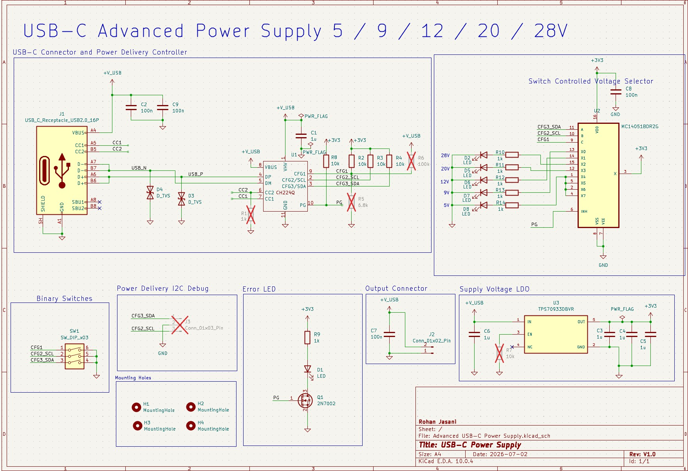

# Technical Design Document: USB-C Variable Power Supply

## 1. Summary

The objective of this design was to engineer a compact, highly versatile printed circuit board (PCB) capable of negotiating and delivering a variable DC voltage directly from a standard USB-C Power Delivery (PD) source. 

The design eliminates the need for bulky benchtop power supplies for low-to-medium power electronics testing by utilizing a **CH224Q** PD controller. This IC handles the USB-C communication protocols, allowing the board to step through a user-selectable output range of **5V to 28V** via hardware-toggled switches. The routing was optimized on a 4-layer stackup using KiCad with 2 signal planes on the top and bottom and 2 GND planes in between, with a strong emphasis on strict Electrical Rules Check (ERC) compliance and clean power delivery.

## 2. Design Requirements & Specifications

The design parameters for the power supply board are detailed in the table below:

| Parameter                | Design Target             |
| :----------------------- | :------------------------ |
| **Input Interface**      | USB Type-C                |
| **PD Controller**        | CH224Q                    |
| **Output Voltage Range** | 5V-28V                    |
| **Voltage Selection**    | Hardware Toggled Switches |
| **PCB Layer Count**      | 4-Layer                   |
| **Design Software**      | KiCad                     |

## 3. System Architecture & Component Selection

### 3.1. Power Delivery Negotiation (CH224Q)
To extract higher voltages from a standard USB-C port, the circuit relies on the CH224Q sink controller. Unlike passive trigger boards, this IC actively communicates with the USB-C host (charger or power bank) to negotiate the highest available power profile. It supports PD3.0/2.0, BC1.2, and other fast-charging protocols, ensuring broad compatibility with modern adapters.

### 3.2. Hardware-Toggled Output Selection
Instead of relying on microcontroller firmware or I2C communication to set the voltage, this board is purely hardware-driven. A series of onboard physical switches are routed to the configuration pins of the CH224Q. By toggling these switches, the user alters the logic states on the IC's voltage-request pins, commanding the chip to dynamically negotiate the target voltage (e.g., 5V, 9V, 12V, 15V, 20V, up to 28V if supported by the source) in real-time.

### 3.3. Signal Integrity & ERC Validation
A unique challenge in EDA software (such as KiCad) when designing configurable power delivery systems is passing the strict Electrical Rules Check (ERC) and Design Rules Check (DRC) without triggering false flags on control lines. 

To resolve this, specific input/output pins on the ICs and surrounding modules were deliberately reconfigured as **bidirectional signal pins** within the schematic symbol properties. This approach ensured rigorous rule-checking compliance and validated the logic pathways without interfering with the integrity of the primary power and ground nets.

## 4. PCB Layout & Routing Considerations

* **Trace Width & Current Handling:** The primary power delivery paths (from the USB-C receptacle to the output terminals) were routed with maximized trace widths of 20 mils (0.508mm) and copper pours to minimize parasitic resistance, while the data lines were routed with 6-10 mils (0.1524-0.254mm) in order to pass clearance constraints with pads and other copper traces. With the addition of these copper pours the board can function with a safe max output of 2A. 
* **Component Placement:** The decoupling capacitors for the CH224Q were placed as close to the IC's power pins as physically possible to filter out high-frequency noise from the USB source.
* **Grounding Strategy:** A continuous ground plane was maintained on the 2 middle layers to provide a low-impedance return path and reduce electromagnetic interference (EMI) for both the top and bottom layer routing.

## 5. Visual Documentation & Manufacturing Assets

*(Below are the detailed layout and 3D views of the completed board design.)*

### Schematic Overview

### Board Layout and Routing

### 3D CAD Renders
**Top View**

**Side View**

**Bottom View**
